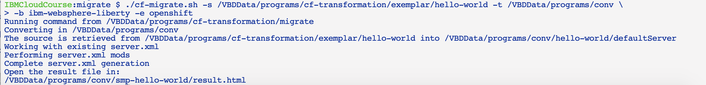
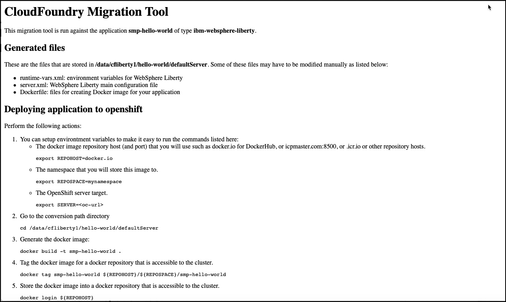

# Cloud Foundry Migration tool

This tool assists you in migrating Cloud Foundry applications to Kubernetes based platforms, such as OpenShift, and IBM Kubernetes Service (IKS).

## Migration tool approach

The migration tool is not designed to provide a fully automated no-touch conversion of the application from Cloud Foundry to Kubernetes. It uses the source code and the environment variables from the running Cloud Foundry application to generate all the necessary assets to deploy that application to a  Kubernetes platform. The tool does require several commands to be run by the user. It is important for the user of the tool to understand the differences between Cloud Foundry and Kubernetes, and the general tasks required to migrate from one to the other. The manual steps required by the tool are meant to help the user understand this process.

The configuration files and other assets generated by  the tool can be used to test and deploy the application to Kubernetes. They can also be used later to help create an automated DevOps pipeline for follow-on application maintenance. The tool is only meant to be run once to migrate a given application. The goal is that once the application is running in Kubernetes, any follow-on maintenance is performed on that platform. 

The assets generated by the tool vary by application language and type, but are typically:

- Binaries and configuration files for the application code
- A Dockerfile to generate the application container image
- YAML configuration files to deploy to Kubernetes

If you are interested in the general concepts behind the migration from Cloud Foundry to Kubernetes, see [Migration](docs/migration.md).

## Using the migration tool

The tool is packaged in a GitHub repository at [this link](https://github.com/ibm-cloud-architecture/cf-transformation). A sample Java application is provided in the exemplar sub-directory. This tool requires the following pre-requisite software to be installed on your system:

- bash
- docker
- jq
- Java Development Kit 
- git
- curl
- xmlstarlet
- maven
- gradle

You can also run the tool using a provided Docker container. Using the container allows you to run the tool without installing the prerequisite software on your system. Details about using the migration tool from the container are found [here](docs/docker.md).

To run the tool, perform the following:

1. Download the tool from GitHub:

		git clone https://github.com/ibm-cloud-architecture/cf-transformation

2. Change the directory to the `migrate` sub-directory:

		cd cf-transformation/migrate

3. Get the content of your application's VCAP_SERVICES environment variables from Cloud Foundry. Most importantly, these variables contain the names, descriptions, and credentials required to access any backend services used by the application:

		cf env <appname> | awk '/VCAP_SERVICES/{flag=1} /^}/{flag=0} flag' | sed 's/"VCAP_SERVICES"://' > vcap.json

3. Run the migration tool against your application source code:

		./cf-migrate.sh -s <source> -t <tempdir> -b <app type> -e <target type>

	Where:

	- `-s` Source path or git repository URL
	- `-t` Temporary conversion directory where the work will be performed and output will be generated (default: /tmp/convdir)
	- `-b` Application type (Cloud Foundry buildpack), such as ibm-websphere-liberty, java, or nodejs
	- `-e` Target environment: openshift, iks or icp

To be able to successfully perform the migration, you will need:

- Docker installed and running
- Account and Command Line Interface (CLI) access to the kubernetes environment (kubectl for IKS, oc for OpenShift)
- Account and CLI access to the Cloud Foundry environment

## Migration tool output

The typical user output from a migration tool run is shown below:

The tool produces an HTML file called `result.html` in the conversion directory. This provides step-by-step instructions for deploying your application to Kubernetes:

For reporting error or providing input for this tool, open an issue in 
[New issue](https://github.com/ibm-cloud-architecture/cf-transformation/issues/new)

