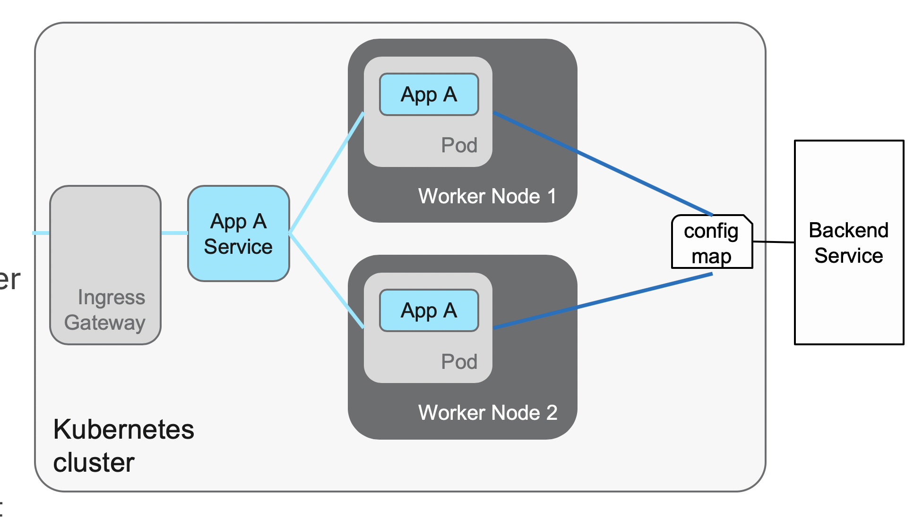

# CF to Kubernetes migration tool
---
## Migration concepts

- Provide a Cloud Foundry application developer to quickly able to migrate and deploy on to a Kubernetes environment, be it an OpenShift or IBM Cloud Private environment
- Minimize learning curve needed to deploy and develop application on a new platform
- Pre-requisites:
	- Known application type (known buildpack)
	- Known service bindings 
	- Manifest file 

---
## CloudFoundry application architecture

---

## Kubernetes application architecture

---
@snap[north span-99 text-09]
## Application Staging 
@snapend
@snap[west span-50 text-06]
### CloudFoundry
All the following are performed by cf push

- The CLI uploads application artifacts to CloudFoundry
- CloudFoundry selects the appropriate BuildPack
- BuildPack prepares the artifacts to create a runnable unit (Droplet)
- CloudFoundry stores the Droplet in the Blob store
- CloudFoundry deploys the Droplet into its Runtime as a Garden Container and provides VCAP_SERVICES to access backend services
- CloudFoundry associates the appropriate Router entry

@snapend

@snap[east span-50 text-06]
### Kubernetes

- Build and assemble the necessary deployment artifacts
- Create a docker image using a Dockerfile and store the image in a Docker repositorydocker build …docker push …
- Create ConfigMap and Secrets to access backend services
- Use deployment YAML to deploy docker image into a Kubernetes Pod in a Deployment or DeploymentConfigkubectl apply -f …
- Use the Service YAML to associate the pods to a Kubernetes Service and optionally define it to an Ingress Gateway or OpenShift Routekubectl apply -f …

@snapend

---

## Migration approach

- Allow developer to understand the process to deploy in Kubernetes
- Build additional configuration files that should not change much provided the application is not changed significantly
- Let developer to deploy manually to Kubernetes or load the process to automatically deploy using Jenkins pipeline
- Prevent automation to create generic migration tool to have a CF application run directly in Kubernetes using buildpack simulation (ie https://buildpacks.io)
- Tools should be run just once when developer need a quick jump-start into Kubernetes

---

## Migration scripts

- The cf-migrate flow (Runtime/Buildpack specific):
- Extract application artifact (get_source.sh)
- Generate application configuration (server_xml.sh and vcap-liberty.sh for liberty)
- Generate Dockerfile (create_dockerfile.sh)
- Generate deployment yaml files (create_yaml.sh)
- Generate Jenkinsfile (not in MVP)
- Produce readme of what artifacts are produced and how to invoke the deployments

---

## Migration tool prerequisites

- Prerequisites:
	- bash
	- jq
	- git
	- curl
	- xmlstarlet
	- maven or gradle
- Or use the provided Docker image: ibmcloudacademy/cfmigrationtool
	- Get the container image:
docker pull ibmcloudacademy/cfmigrationtool 
	- Use a path from the host that you will use to store the output, assuming that you use /Users/ibmuser/data:
docker run --net=host -v /Users/ibmuser/data:/data -it ibmcloudacademy/cfmigrationtool bash
---

## Running migration tool

- Download the tool from GitHub:
git clone https://github.com/ibm-cloud-architecture/cf-transformation 
- Change the directory to the migrate sub-directory:
cd cf-transformation/migrate 
- Get the content of your application VCAP_SERVICES from Cloud Foundry (optional):
cf env <appname>  > vcap.json  
- Run the migration tool against your source:
./cf-migrate.sh -s <source> -t <tempdir> -b <app type> -e <target type> 

	- -s: migration source, can be local path or a HTTPS git repository link
	- -t: the processing and result path, useful for defining container shared path
	- -b: application or buildpack type (ibm-websphere-liberty, java, nodejs)
	- -e: target type (openstack, iks, icp)	

---

## Sample output

