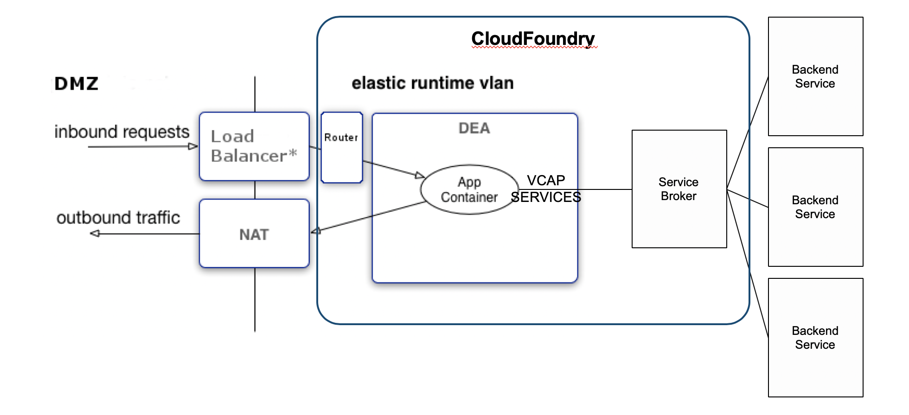
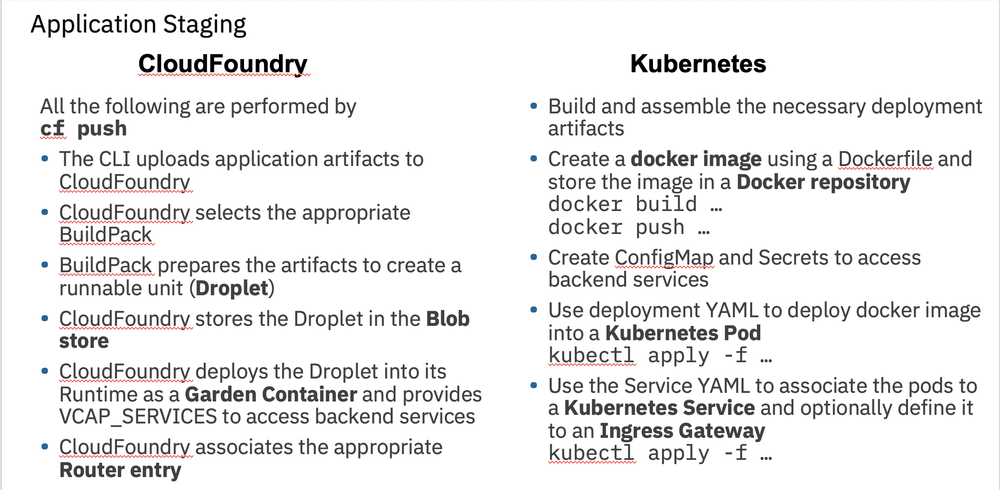

# CloudFoundry vs Kuberentes

The application in CloudFoundry is configured as: 

The application in Kubernetes is configured as:

The deployment in CloudFoundry is performed using the command `cf push`. While in Kubernetes there are quite a few steps to perform staging of the application. 

