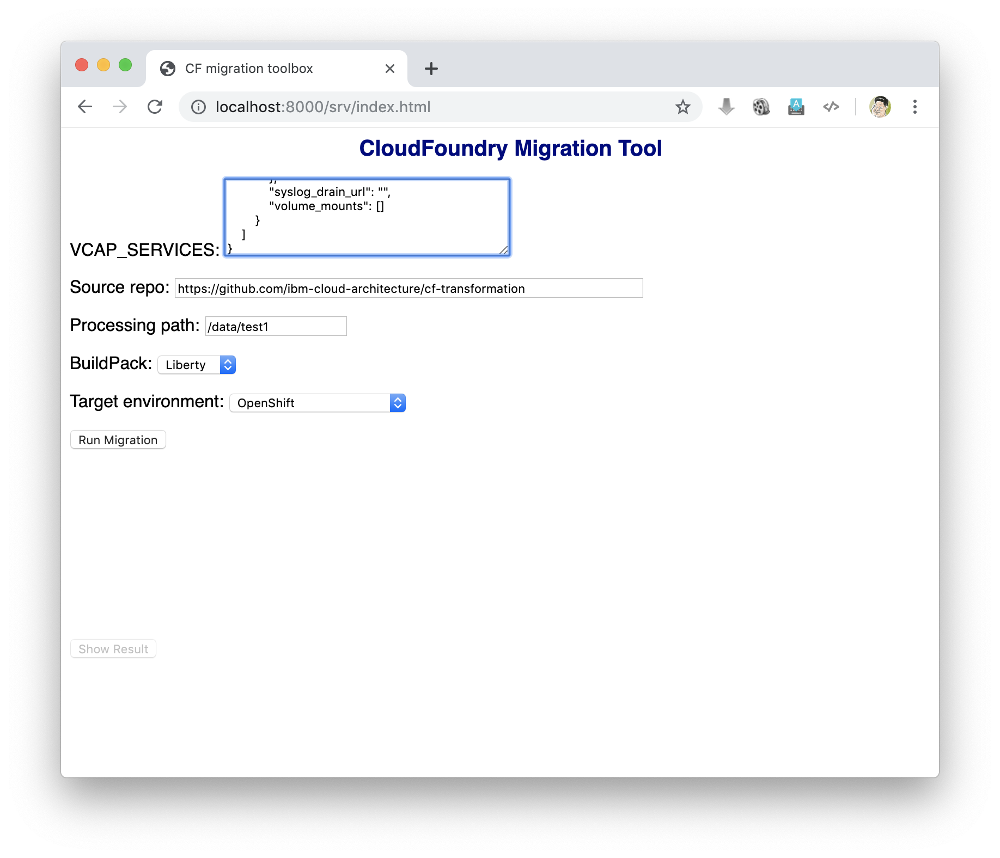
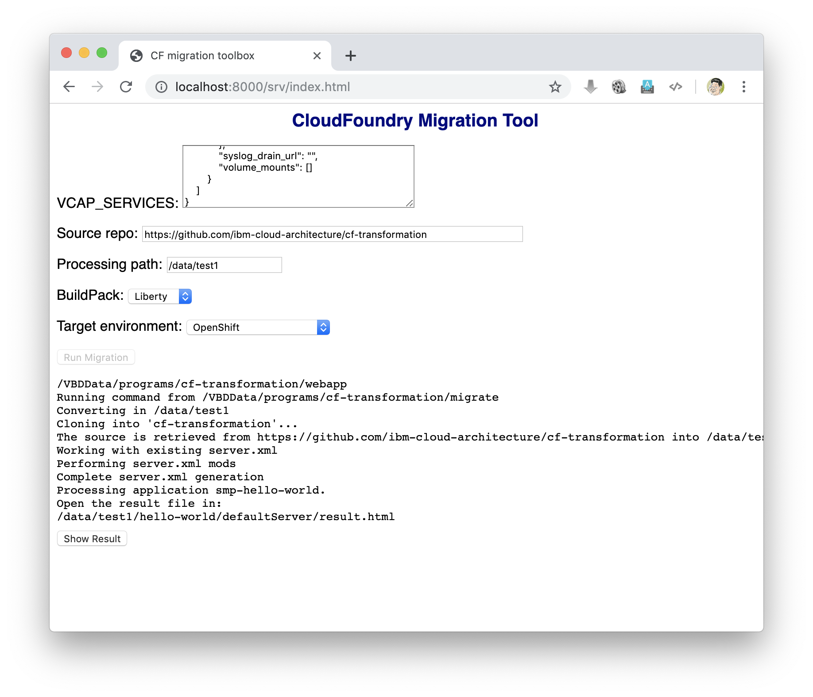
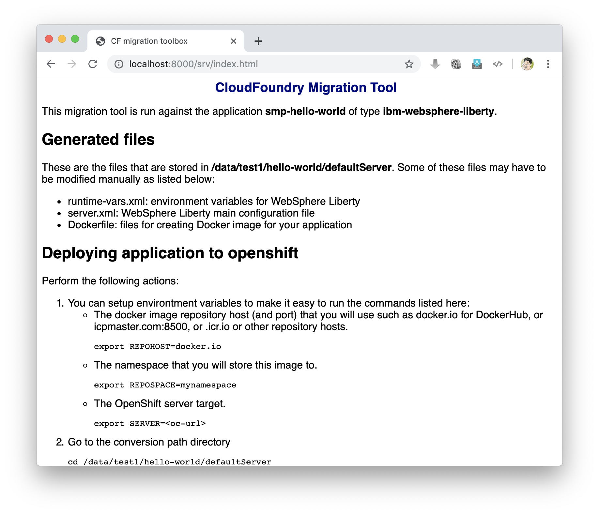

# Web application

The Web application for the CF migration tool allows you to use a Web browser to interact and run the tool. The requirements for the Web application are:

- git
- node.js and npm

You can also use the provided Docker image *ibmcloudacademy/cfmigrationtool*.

To use the Web application, perform the following:

1. Get the application from GIT:

		git clone https://github.com/ibm-cloud-architecture/cf-transformation

2. Go to the webapp path:

		cd cf-transformation/webapp

3. Initialize node.js dependencies:

		npm install

4. Start the application:

		node app.js
	or

		nodejs app.js

5. Open a Web browser to get to the application port 8000 (ie `http://localhost:8000`)

6. Specify the arguments (source repo/path, conversion dir, buildpack and target type) then click **Run migrate**.

	

7. Once the command is completed, you can see the output. If the command run successfully (as indicated by the result.html file at the end of the output), then you can click the **Show Result** button.

	

6. You are presented with the result.html.

	
